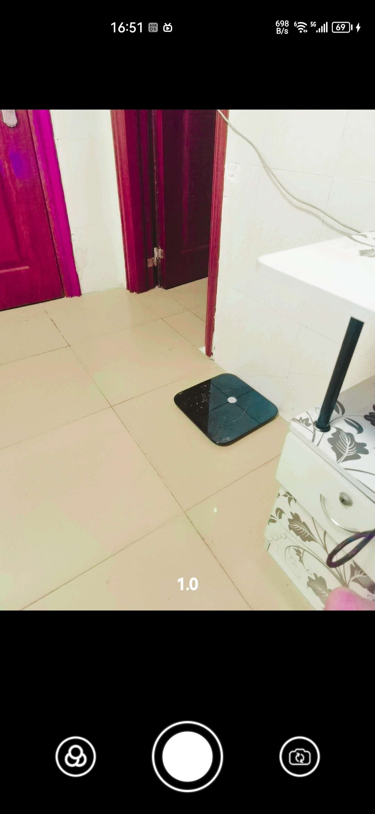
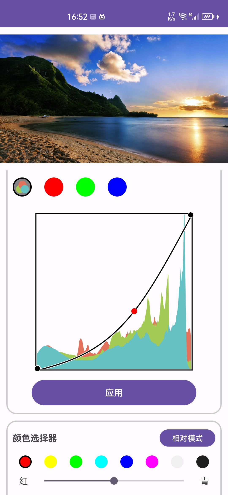
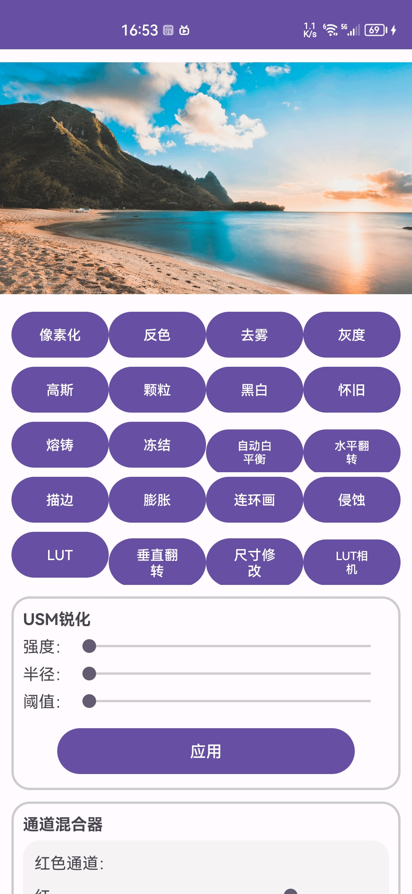

# 简介
该项目主要作用是对图片进行编辑、滤镜、相机实时滤镜等功能。项目基于Opencv实现。该项目对应的产品在华为市场上有发布，商城中的大部分功能在本项目中均可实现，不过部分蒙版用到华为AI，在本项目中没有，应用市场地址为：https://appgallery.huawei.com/app/C106742643

# 项目图片




# 项目功能
bitmap为处理图片，bitmapMask为蒙层
+ LUT相机：CameraActivity.start(Context context)
+ 图片像素化：OpenCvIn.makeBitmapToPixel(bitmap,bitmapMask,5)
+ 图片反色：OpenCvIn.makeBitmapColorCounter(bitmap) 
+ 图片去雾：OpenCvIn.makeBitmapRemoveFog(bitmap,bitmapMask,0.5f) 
+ 图片灰度：OpenCvIn.makeBitmapGray(bitmap) 
+ 图片高斯：OpenCvIn.makeBitmapBlur(bitmap,bitmapMask,10)
+ 图片颗粒化：OpenCvIn.makeBitmapParticles(bitmap,bitmapMask,10) 
+ 图片黑白化：OpenCvIn.makeBitmapWhiteAndBlack(bitmap) 
+ 图片怀旧：OpenCvIn.makeBitmapNostalgia(bitmap) 
+ 图片熔铸：OpenCvIn.makeBitmapFounding(bitmap) 
+ 图片冻结：OpenCvIn.makeBitmapFrozen(bitmap) 
+ 图片描边：OpenCvIn.makeBitmapEdge(bitmap) 
+ 图片膨胀：OpenCvIn.makeBitmapDilate(bitmap) 
+ 图片连环画：OpenCvIn.makeBitmapComics(bitmap)
+ 图片侵蚀：OpenCvIn.makeBitmapErode(bitmap) 
+ 图片水平翻转：OpenCvIn.getRotationXY(bitmap,true) 
+ 图片垂直翻转：OpenCvIn.getRotationXY(bitmap,false) 
+ 图片尺寸：OpenCvIn.imageResize(bitmap,0.4,0.4) 
+ 图片LUT滤镜：OpenCvIn.makeBitmapChangeByLut(bitmap,lutFilePath) 
+ 图片USM锐化：OpenCvIn.usmFilter(bitmap,bitmapMask,0,0,0) 
+ 通道混合器：OpenCvIn.mixColorChannel(bitmap,bitmapMask,MixColorChannel) 
+ 自动白平衡：OpenCvIn.autoColorBalance(bitmap) 
+ 曲线工具：OpenCvIn.curveToolsPro(bitmap,bitmapMask,redXArray,redYArray,greenXArray,greenYArray,blueXArray,blueYArray,rgbXArray,rgbYArray) 
+ 颜色选择器：OpenCvIn.changeColorByChannelPro(Bitmap bitmap,Bitmap mask,
                                                        float redRed, float redGreen, float redBlue,float redBlack,
                                                        float greenRed, float greenGreen, float greenBlue,float greenBlack,
                                                        float blueRed, float blueGreen, float blueBlue,float blueBlack,
                                                        float cyanRed, float cyanGreen, float cyanBlue,float cyanBlack,
                                                        float yellowRed, float yellowGreen, float yellowBlue,float yellowBlack,
                                                        float carmineRed, float carmineGreen, float carmineBlue,float carmineBlack,
                                                        float whiteRed, float whiteGreen, float whiteBlue,float whiteBlack,
                                                        float blackRed, float blackGreen, float blackBlue,float blackBlack,
                                                        boolean isRelative);
+ HSL：OpenCvIn.hsl(Bitmap bitmap,Bitmap mask,float r_s,float r_h,float r_b
            ,float g_s,float g_h,float g_b
            ,float b_s,float b_h,float b_b
            ,float c_s,float c_h,float c_b
            ,float m_s,float m_h,float m_b
            ,float y_s,float y_h,float y_b
            ,float o_s,float o_h,float o_b
            ,float p_s,float p_h,float p_b)
+ 饱和度：
```
val tmp = OpenCvIn.changeSaturationTwo(Bitmap bitmap,Bitmap mask,float saturationStrength)
val currentBitmap = OpenCvIn.startChangeHsbS(Bitmap bitmap,Bitmap mask, float redAdjust, float greenAdjust, float blueAdjust, float cyanAdjust, float yellowAdjust, float carmineAdjust)
```
+ 明度：OpenCvIn.changeLightByChannel(Bitmap bitmap,Bitmap mask,float redValue,float yellowValue,float greenValue,float cyanValue,float blueValue,float carmineValue)
+ 色相：OpenCvIn.startChangeHsbH(Bitmap bitmap,Bitmap mask, float redAdjust, float greenAdjust, float blueAdjust, float cyanAdjust, float yellowAdjust, float carmineAdjust)
+ 色彩平衡：OpenCvIn.changeColorBalance(Bitmap bitmap,Bitmap mask,
                                                   int cyanAndRedLow, int carmineAndGreenLow, int yellowAndBlueLow,
                                                   int cyanAndRedMiddle, int carmineAndGreenMiddle, int yellowAndBlueMiddle,
                                                   int cyanAndRedHight, int carmineAndGreenHight, int yellowAndBlueHight)
+ 对比度：OpenCvIn.brinessAndContrastChange(Bitmap bitmap,Bitmap mask, int briness, int contrast)
+ 亮度：OpenCvIn.brinessAndContrastChange(Bitmap bitmap,Bitmap mask, int briness, int contrast)
+ 高光阴影：OpenCvIn.HighAndDarkLightChange(Bitmap bitmap,Bitmap mask,float darkLight,float highLight)
+ 色温：OpenCvIn.changeTemp(Bitmap bitmap,Bitmap mask,int tempValue)
+ 色调：OpenCvIn.changeColorHue(Bitmap bitmap,Bitmap mask,int tempValue)
+ 暗角：OpenCvIn.darkCorner(Bitmap sourceBitmap,Bitmap maskBitmap,boolean isBlac,float strength)

